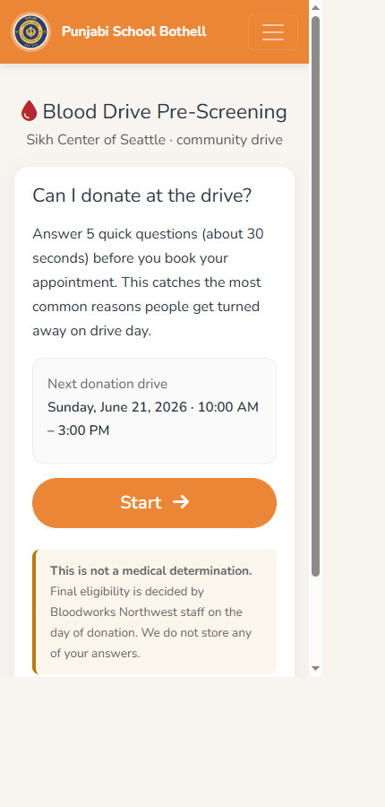
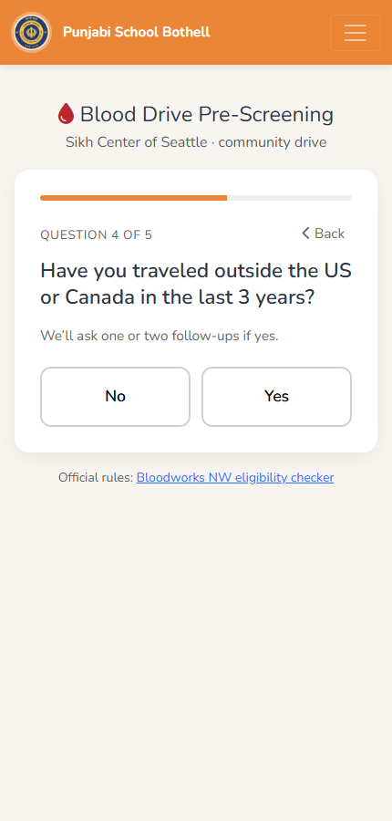
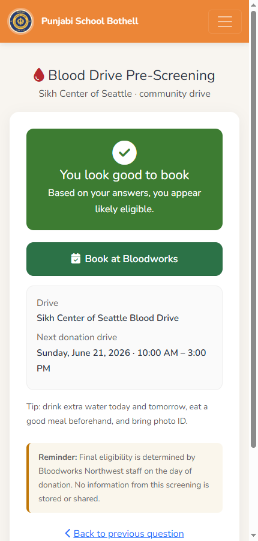

# Shipping a Real Community Tool in an Afternoon with Spec-Driven AI Pair-Programming

> **A blood drive was wasting slots. I had an afternoon. Here's what actually worked.**

*A field report on using GitHub Copilot's agent mode to take a community problem from a vague description to a deployed tool — with the spec doing most of the heavy lifting.*

- **Project:** [Blood Drive Pre-Screening Tool](https://punjabischoolbothell.org/programs/blood-drive/) for the Sikh Center of Seattle (built for [Punjabi School Bothell](https://punjabischoolbothell.org/))
- **Case study:** [Reducing Wasted Slots at a Community Blood Drive](./blood-drive-case-study.md)
- **Stack:** One static HTML file. No build step. No framework. No analytics.

---

## TL;DR

Our community blood drive kept losing appointment slots to donors who were ineligible on the day of donation — most often because of recent international travel. In an afternoon, working with GitHub Copilot in agent mode, I:

1. Wrote a short spec describing the problem and the smallest useful solution.
2. Pruned the spec down once I found the partner ([Bloodworks Northwest](https://bloodworksnw.org/eligibility-checker)) already publishes a full eligibility checklist.
3. Generated a single-file static web tool that pre-screens donors in 30 seconds.
4. Iterated five or six times — adding short-circuit logic, dynamic sub-questions, a Back button, fixing a real bug, deep-linking to the right drive.
5. Wrote an automated end-to-end test, ran 24 assertions, fixed the test (not the code), and shipped.

### By the numbers

| ⏱ Time | 📄 Files | 📏 Code | ✅ Tests | 🚫 PII | 🛠 Build steps | 💰 Cost |
|---|---|---|---|---|---|---|
| 1 afternoon | 1 HTML | ~500 LOC | 24 / 24 | 0 fields | 0 | $0 |

The whole thing is one HTML file, served from the PSB site at <https://punjabischoolbothell.org/programs/blood-drive/>.

The interesting part isn't the code — it's the **workflow**.

> The model is fast. **The spec is the steering wheel.**

## 🎯 Key Lessons at a Glance

| | Takeaway |
|---|---|
| 💡 | Start unstructured — let the assistant impose the first structure, then react to it. |
| 💡 | Before building, find out what the world already has. The biggest scope wins come from *not* building something. |
| 💡 | AI assistants are excellent at writing the next change. They are *not* a substitute for clicking through your own UI. |
| 💡 | Failing tests aren't always code bugs — read the failure before reaching for the fix. |
| 🔧 | Every UI change gets a manual click-through before it ships. |
| 🔧 | Constraints are more powerful than goals. Add constraints early. |

## Why a spec at all?

The temptation with an AI coding assistant is to skip straight to *"build me X."* That works for throwaway snippets. It breaks down the moment the problem is fuzzy, you need to iterate ten times, or you want to push back when the model over-builds.

A short spec — even one written in five minutes — is the contract you and the AI keep returning to. When the model wants to add a country picker, you point at the line that says *"keep it bare minimum"* and it complies. **Spec is the slow-changing artifact; the code is downstream.**

## See it in action

*Welcome screen — drive details, disclaimer, single Start button.*

*One question at a time, with progress and a Back button on every screen.*

*Green — the only outcome that links to the Bloodworks booking page for this drive.*

## The flow I actually used

### 1. Voice-drafted the problem out loud

The first message to Copilot was effectively a stream-of-consciousness description of the problem: the Sikh Center of Seattle hosts a community blood drive, parents travel back to home countries, they show up and get deferred, slots get wasted — *can we build something*? No requirements doc. No structure. Just the situation.

Copilot's first response was a structured proposal: a welcome screen, hard-stop questions, additional screening, Green/Yellow/Red outcomes. That became the seed of the spec.

> 💡 **Lesson** — Start unstructured. Let the assistant impose the first structure. Then react to it.

### 2. Wrote a v0.1 spec

I turned the proposal into a `SPEC.md` with sections for Problem, Goals, Non-Goals, Users, User Flow, Functional Requirements, Tech Stack, Rollout, Open Questions. Standard PRD-lite.

It was too ambitious. It had a country-by-country travel rule engine, optional AI chat, multi-language support, analytics, a rules JSON authored by a volunteer.

That was fine — drafts are allowed to be wrong. The next step is what mattered.

### 3. Killed scope with one external fact

Before building anything, I checked what the partner already publishes. Bloodworks Northwest hosts a [60-Second Eligibility Checklist](https://bloodworksnw.org/eligibility-checker) with the full ruleset.

That single fact collapsed half the spec:

> "We should keep the checker tool to bare minimum to ensure this is quick and effective."

Out went the country picker, the medication list, the rules JSON, the analytics. The spec shrank to **five questions** that catch the most common community-specific reasons for deferral, and a "Yellow" off-ramp that says *go run the official checker*.

> 💡 **Lesson** — Before building, find out what the world already has. The biggest scope wins come from *not* building something.

### 4. Generated the implementation

The new, leaner spec said: single static HTML file, mobile-first, no build, ships on the existing GitHub Pages site, config in a JSON-shaped block at the top.

Copilot generated the whole page in one shot. Bootstrap 5 + FontAwesome to match the rest of the site. A small `CONFIG` object for drive details, a `QUESTIONS` array for the question data, and a tiny engine that walks the questions and renders a result.

Because the spec was clear about constraints — *no PII, no analytics, no build step, mobile-first, match site styling* — there was no debate about any of these. The model just complied.

### 5. Iterated against the spec, not the code

Once the page existed, every change was a one-line user request that I mapped to a spec property:

| User request | Spec property it maps to |
|---|---|
| "At each step jump to red if the check fails" | UX speed — don't waste a clear-fail donor's time |
| "Add sub-questions under travel if Yes" | Specificity for the highest-frequency reason |
| "Back should return to the last page" | Forgive misclicks; reduce friction |
| "Remove address, keep time" | Bare minimum on the welcome screen |
| "The appointment slot should be ..." | Sikh-Center-specific drive deep link |

Each request became a small diff. The spec made it obvious where each change belonged.

### 6. Hit a real bug — and I found it because I clicked

The "Back" button worked from any normal question. But after a Red short-circuit on Question 1, Back jumped to Question 5 instead of Question 1.

> 🐞 **Bug postmortem**
> | | |
> |---|---|
> | **Severity** | Low — single edge case, no data loss |
> | **Time-to-detect** | ~10 seconds of human clicking |
> | **Detected by** | Me, not the AI |
> | **Root cause** | Red short-circuit set `state.step = queue.length`, so the Back handler's naive `step - 1` landed at the end of the queue |
> | **Fix size** | 3 lines |
> | **Fix approach** | Derive previous step from `state.history.length` (the true count of answered questions) instead of subtracting from `state.step` |
> | **Why the fix was small** | The model had preserved the `state.history` abstraction already in use for un-splicing follow-ups |

Two things worth calling out:

1. **I found the bug, not the AI.** Copilot was happy to claim the feature worked. A human clicking around in 10 seconds caught it.
2. **The fix was small because the model preserved the abstraction.** `state.history` already existed; I just used it as the source of truth for navigation too.

> 💡 **Lesson** — AI coding assistants are excellent at writing the next change. They are *not* a substitute for clicking through your own UI.

### 7. End-to-end test, ran the suite, fixed the test

Before pushing, I asked Copilot to write and run an end-to-end test using the browser tooling. It generated a Playwright script that covered ten user journeys: Green, Yellow, Red on each hard-stop position, the travel sub-chain with all three malaria answers, Back after a Red short-circuit, mid-flow Back un-splicing follow-ups, and Start Over.

First run: 17 of 24 assertions passed. Seven failures all looked similar — substring checks on the progress counter.

I didn't change the code. I looked at the failures and noticed the assertions were case-sensitive (`Question 1 of 5`) but the CSS applied `text-transform: uppercase`, so `innerText` returned `QUESTION 1 OF 5`. Lowercase the comparisons. Re-ran. **24 of 24 passed.**

> 💡 **Lesson** — Failing tests aren't always code bugs. Read the failure before reaching for the fix. The model is great at writing test scaffolding but doesn't always reason about CSS-affected DOM strings.

### 8. Site integration, then ship

Last steps were trivial because the structure held:

- Added a **Community** dropdown to every root page's nav.
- Renamed `SPEC.md` to `README.md` so GitHub renders it as the folder landing page.
- Reframed the README as a case study (background → problem → constraints → solution → value → out of scope → post-drive follow-up).
- Single commit, push, done.

Total elapsed time: an afternoon. Total lines of net new code: ~500.

## Patterns that worked

### "Keep it bare minimum" as an explicit rule

The single most valuable line in the spec was a literal sentence: *"Design rule: keep it bare minimum. Anything not high-frequency for our community is routed to Bloodworks rather than re-implemented here."*

I quoted this back to the model — implicitly — every time it offered to add complexity. The rule was a fence the model respected.

### Spec-first, code-second, on every change

Even small UX requests started with a spec lens: *"is this in scope per the spec?"* If yes, change the code. If no, change the spec first or push back on the request.

This prevents scope creep from being a thousand individual yeses. Each yes is fine; the cumulative drift is not.

### Config-first design

Putting the drive date, time, scheduler URL, Bloodworks links, and phone in a single `CONFIG` object at the top of the script made one thing true: **a volunteer can update the tool for the next drive without touching engine code.** That single design choice probably matters more than any other line in the file.

### Reading the model's diffs

I treated every AI-produced diff like a junior dev's PR — read it, understand it, accept or push back. A few times the model added a helper or an abstraction I didn't need; calling that out (and citing the implementation-discipline principle) kept the file lean.

### Stopping when done

There's always one more feature ("Add a QR code generator! Add Punjabi! Add analytics!"). I listed them as Open Questions in the README and shipped. The drive is on June 21. The best version of this tool is the one that's live before then.

## Patterns that didn't work (and what I did instead)

### The Trust-the-Model Fallacy

I trusted the first Back-button implementation. It looked right in the code. Real clicks revealed the Q1 short-circuit bug.

> 🔧 **Fix** — Every UI change gets a manual click-through before it ships. The model can write the test; the human still has to drive the browser.

### The Scope-by-Default Trap

The first spec was too ambitious because nothing in the conversation pushed back. Once I added the constraint *"keep it bare minimum"* and the fact *"Bloodworks already publishes a full checker"*, the model converged on the right scope immediately.

> 🔧 **Fix** — Constraints are more powerful than goals. Add constraints early.

### The One-Giant-Test-at-the-End Anti-Pattern

The end-to-end test was a great idea, but writing it after every feature was already in would have been brittle. Next time: write a tiny smoke test after the first green-path renders, then add assertions per feature.

## What the spec did for me, concretely

Without the spec I would have:

- Built a country picker I didn't need.
- Reimplemented half of Bloodworks' rules and had to maintain them.
- Stored donor responses "for analytics" without thinking about PII.
- Skipped the disclaimer.
- Probably forgotten to handle the Back-after-Red case at all.

With the spec I:

- Said no to country pickers in seconds, not days.
- Pointed at Bloodworks for everything past the bare minimum.
- Made "no PII, no storage" a non-negotiable from line one.
- Wrote the disclaimer copy once and reused it on every screen.
- Caught the Back-after-Red bug because the spec had stated *"Back should be on the last page where user was"* — making the requirement testable.

## Reusable workflow for the next project

1. **Talk to the assistant in plain language about the problem.** No structure. See what shape it proposes.
2. **Write a one-page spec in markdown.** Problem, goal, non-goals, constraints, design rule, success metric. That's it.
3. **Check what already exists.** A 30-second search for an existing partner tool or library can delete half your spec.
4. **Add explicit constraints to the spec.** "Keep it bare minimum." "Single file." "No PII." "No build step." Constraints are how you steer.
5. **Generate the first version in one shot.** Don't piecemeal it. A complete first cut is easier to critique.
6. **Iterate via small user requests mapped back to spec properties.** Push back when a request would violate the spec.
7. **Click through your own UI before declaring victory.** Every time.
8. **Have the assistant write an end-to-end test, then run it and read the failures honestly.**
9. **Ship the README as a case study.** Future-you and your team will both thank you.

## Why this matters beyond one tool

This was a 500-line static page for a community blood drive. The same workflow applies to a 5,000-line internal service or a customer-facing feature.

What changes at scale is the cost of *not* having the spec. Without one, an AI-paired afternoon is a great way to ship a brittle pile of features that nobody can extend. With one, the same afternoon produces a coherent thing with a clear scope, a real boundary, and a story you can tell.

The model is fast. The spec is the steering wheel.

---

### About this project

- **Live tool:** <https://punjabischoolbothell.org/programs/blood-drive/>
- **Case study:** [Reducing Wasted Slots at a Community Blood Drive](./blood-drive-case-study.md)
- **Partner:** [Bloodworks Northwest](https://bloodworksnw.org/)
- **Drive:** Sikh Center of Seattle — Sunday, June 21, 2026

If you run community drives and want to copy this pattern, the entire tool is one HTML file. Fork it, change the `CONFIG` block, change the five questions for your community's reality, point the schedule link at your drive, and ship.

**What this cost me:** $0. ~4 hours. One Copilot subscription I already had.

---

*Author: [Manpreet Jammu](https://github.com/msjammu) · [LinkedIn](https://www.linkedin.com/in/msjammu/)*
