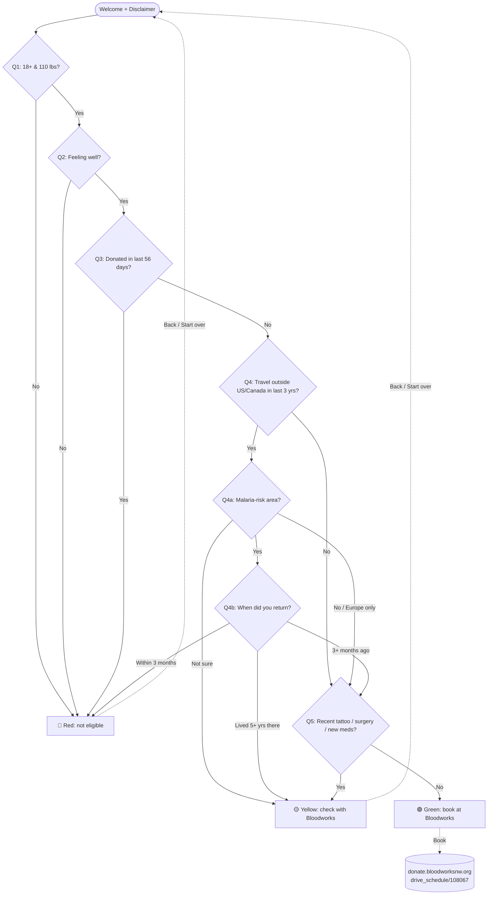

# Case Study — Reducing Wasted Slots at a Community Blood Drive

- **My role:** Volunteer + sole developer of the pre-screening tool
- **Organization:** Punjabi School Bothell (PSB) in partnership with the Sikh Center of Seattle
- **Partner:** Bloodworks Northwest
- **First deployment:** Sikh Center of Seattle blood drive — Sunday, June 21, 2026 (10:00 AM – 3:00 PM)
- **Live tool:** <https://punjabischoolbothell.org/programs/blood-drive/>
- **Related write-up:** [Shipping a Real Community Tool in an Afternoon with Spec-Driven AI Pair-Programming](./2026-05-31-spec-driven-ai-pair-programming.md)

---

## TL;DR

I built a 30-second pre-screening web tool, in one afternoon, to cut wasted appointment slots at our community blood drive. Single static HTML file. No PII, no analytics, no build step. Ships from the existing GitHub Pages site, and any volunteer can update it for the next drive by editing one config block.

- **Problem:** donors book, show up, and get deferred on the spot (most often for recent international travel) — wasting slots Bloodworks staff can't refill.
- **Approach:** 5 community-specific questions with short-circuit logic and a Yellow off-ramp to Bloodworks' official checker. I deliberately did **not** re-implement Bloodworks' full ruleset.
- **Outcome (target, June 21 drive):** higher slot utilization, lower on-site deferral rate, more pints collected per drive day.

---

## 1. Background

Every few months the Sikh Center of Seattle organizes a community blood donation drive in partnership with Bloodworks Northwest. The Punjabi School Bothell (where I volunteer) helps mobilize parents, families, and community members to fill the appointment slots.

It is, in every sense, a community event: parents donate, students hand out water and snacks, and Bloodworks staff run the medical screening and collection on-site.

## 2. The Problem I Set Out to Solve

Despite strong sign-ups, each drive consistently **loses appointment slots** because donors show up and are then deferred on-site after Bloodworks' formal screening.

From talking with past drive volunteers, the most common reasons in this community, in order of frequency, are:

1. **Recent international travel to malaria-risk regions** — parents visiting **India, Pakistan, Bangladesh, Nepal, Mexico, or parts of sub-Saharan Africa**. Bloodworks defers donors for 3 months after travel to such areas (and longer for former residents).
   > Authoritative list of malaria-risk countries: [CDC Yellow Book — Malaria Information by Country](https://wwwnc.cdc.gov/travel/yellowbook/2024/preparing/malaria-risk-information-and-prophylaxis-by-country).
2. **Donated whole blood within the last 56 days** (the federally mandated waiting period).
3. **Feeling unwell** the day of the drive (fever / cold / flu in the previous 48 hrs).
4. **Recent tattoo, piercing, surgery, or new medication** within the last 3 months.

Impact on the drive:

- An ineligible donor occupies a slot another community member could have used.
- Bloodworks staff spend screening time on donors who will not donate.
- Volunteers see a "no" on drive day, which is demoralizing.
- The total pints collected per drive comes in under the slot capacity.

Bloodworks already publishes a comprehensive [60-second eligibility checklist](https://bloodworksnw.org/eligibility-checker) — but in practice donors book first and read it (or skip it) later.

## 3. Constraints I Set

| Constraint | Implication |
|---|---|
| Must not be a medical determination | I built it as a pre-flight only; final eligibility stays with Bloodworks staff on drive day. |
| Cannot collect or store health information | No login, no PII, no analytics, no server-side storage. |
| Must work on a phone in a parking lot | Mobile-first, no build step, hosted on the existing GitHub Pages site. |
| Community has limited engineering time | Single static HTML file; any volunteer can edit a config block to update drive details. |
| Bloodworks' full rules change over time | I deliberately did **not** re-implement them — the tool links out to Bloodworks for anything nuanced. |

> **My design rule: keep it bare minimum.** If a question isn't high-frequency for our community, it doesn't belong in this tool.

## 4. The Solution I Built

A **30-second pre-flight web page** at [`punjabischoolbothell.org/programs/blood-drive/`](https://punjabischoolbothell.org/programs/blood-drive/).

### 4.1 Flow

Five base questions, with up to two follow-ups for the travel question. A bad answer to a hard-stop question (age/weight, feeling well, recent donation, recent travel to a malaria-risk region) **short-circuits straight to the result** — the donor doesn't have to keep clicking once they've already been disqualified.



### 4.2 Questions

| # | Question | Bad answer → result |
|---|---|---|
| 1 | Are you **18+** and **at least 110 lbs**? | No → 🔴 Red |
| 2 | Are you **feeling well today** (no fever/cold/flu in last 48 hrs)? | No → 🔴 Red |
| 3 | Have you donated **whole blood in the last 8 weeks** (56 days)? | Yes → 🔴 Red |
| 4 | Have you **traveled outside the US or Canada in the last 3 years**? | Yes → ask Q4a |
| 4a | *(if travel = Yes)* Was any of that travel to a **malaria-risk area**? | Yes → ask Q4b · Not sure → 🟡 Yellow |
| 4b | *(if malaria-risk = Yes)* When did you return? | Within 3 months → 🔴 Red · 5+ year resident → 🟡 Yellow |
| 5 | Last 3 months: **new tattoo, piercing, surgery, or new medication**? | Yes → 🟡 Yellow |

### 4.3 Outcomes

| Result | Meaning | Call to action |
|---|---|---|
| 🟢 **Green** | All answers safe | "Book at Bloodworks" → direct link to the Sikh Center drive (`drive_schedule/108067`) |
| 🟡 **Yellow** | An answer needs a closer look | "Use Bloodworks' full checker" + Bloodworks phone link |
| 🔴 **Red** | A hard disqualifier today | Encourage next drive; link to Bloodworks rules |

A **Back** button is available on every question and every result screen, so a misclick is a one-tap fix even after a Red short-circuit. Every result page repeats the disclaimer that final eligibility is decided by Bloodworks staff on drive day.

## 5. Implementation Notes

I built it as a single static HTML file. No build step, no framework, no analytics. It reuses the same Bootstrap 5 + FontAwesome CDNs as the rest of the PSB site so it visually matches without extra dependencies.

I organized the page into three blocks:

- **`CONFIG`** — drive name, date, time, Bloodworks scheduler URL, Bloodworks checker URL, phone. Any volunteer can edit this for the next drive without touching engine code.
- **`QUESTIONS`** — an array of questions. Each option carries `bad`, `level` (`red`/`yellow`), `reason`, and an optional `followUp: [...]` array for nested questions. Adding or rewording a question is a data-only change.
- **Engine** — renders Welcome → walks `state.queue` (which dynamically grows as follow-ups splice in) → renders a Result. I keep a per-step `state.history` that records what each answer did (trigger pushed? how many follow-ups spliced in?) so **Back** correctly undoes both the trigger and the splice, keeping the progress counter and queue in sync.

### Site integration

I added a **Community** dropdown to the main navigation on every root page of the PSB site, with a single item linking to the pre-screening tool, so future community tools can slot into the same menu.

### Privacy

- No login, no PII, no cookies, no analytics.
- Answers exist only in browser memory and are discarded on page close.

## 6. Value Delivered

| Stakeholder | Value |
|---|---|
| **Prospective donor** | Knows in 30 seconds whether to bother booking. Avoids a wasted trip on drive day. |
| **Drive organizer (Sikh Center / PSB)** | Fewer no-shows and on-site deferrals → more pints collected per drive. |
| **Bloodworks staff** | Donors who arrive are more likely to pass formal screening → faster line, less wasted staff time. |
| **Community** | Higher drive yield → more lives saved per drive day. |

### Measurable goals for the June 21, 2026 drive

- ≥ 50 pre-screenings completed (anonymous count via QR scans / referrer).
- Lower on-site deferral rate than the previous drive.
- Higher appointment-slot utilization (booked → actually donated).

## 7. What I Deliberately Did NOT Build

- Not a medical determination.
- Not a re-implementation of Bloodworks' full checklist.
- Not a database of personal or health information.

## 8. Editing for Future Drives

Any volunteer can update the `CONFIG` object near the top of the `<script>` block in the page:

```js
const CONFIG = {
    event: {
        name: "Sikh Center of Seattle Blood Drive",
        date: "Sunday, June 21, 2026",
        time: "10:00 AM – 3:00 PM"
    },
    links: {
        schedule:        "https://donate.bloodworksnw.org/donor/schedules/drive_schedule/108067",
        bloodworksCheck: "https://bloodworksnw.org/eligibility-checker",
        bloodworksPhone: "tel:+18003983767",
        bloodworksPhoneDisplay: "1-800-398-7888"
    }
};
```

To add or change a question, edit the `QUESTIONS` array right below. Each option is a `{ label, bad, level?, reason?, followUp? }` object.

## 9. Out of Scope (for now)

Things I considered and intentionally left out:

- AI chat / free-text input
- Country-by-country travel rules (Bloodworks' checker handles this)
- Medication database
- Storing or analyzing donor responses
- Account/login/appointment booking (the tool links out to Bloodworks)

## 10. Open Questions I'm Tracking

- [ ] Are the 5 base questions the right 5 for this community? (I plan to ask 1–2 past drive volunteers.)
- [ ] Confirm the Bloodworks phone number to publish.
- [ ] Add a Punjabi (Gurmukhi) language toggle?
- [ ] Print a QR code on the flyer pointing at this page.

## 11. Post-Drive Follow-Up *(I'll fill this in after June 21, 2026)*

- Pre-screenings completed: _TBD_
- Appointment-slot utilization (booked → donated): _TBD_
- On-site deferral rate vs. previous drive: _TBD_
- Volunteer feedback: _TBD_
- Changes for next drive: _TBD_

---

*Author: [Manpreet Jammu](https://github.com/msjammu) · [LinkedIn](https://www.linkedin.com/in/msjammu/)*
